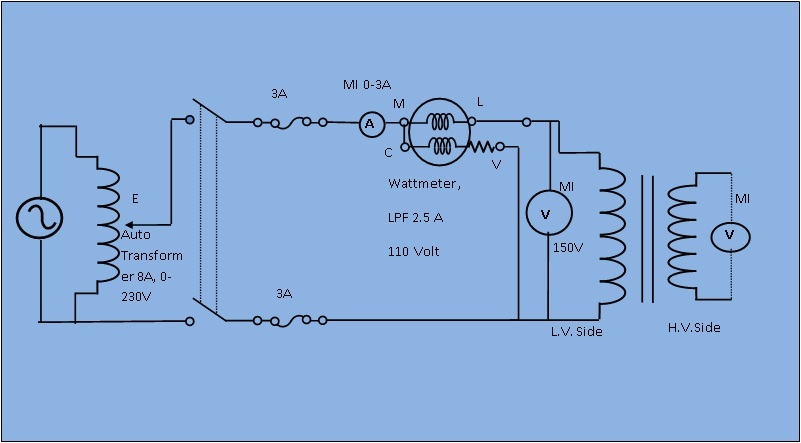
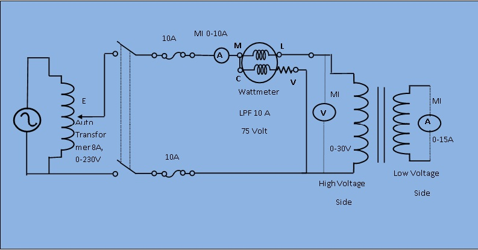

### Procedure

<b><strong>OPEN CIRCUIT TEST:&nbsp;&nbsp;</strong></b>

							 
							
<b><strong>Circuit Diagram-1:</strong></b>

							 
							

                                	
							
Fig. 1. Circuit diagram for open circuit test

							 						
							
<b><strong>Procedure:</strong></b>

							&nbsp;
							<ol>
								<li>Connect the circuit as shown in circuit Diagram-1,choosing suitable instrument.</li>
								<li>Switch on the supply, keeping output voltage at auto-transformer at zero. Increase the voltage in set up to rated and tabulated the no load current, input power and the primary and secondary voltages corresponding to each value of the applied voltage in Table no-1.</li>
							</ol>
							&nbsp;
							
<strong>Table 1 :</strong>

							 <table  cellspacing='0' style= "width:80%;">
							<tr><td>Sl.No.</td><td>Primary Voltage V1 (L.V. Side)</td><td>Primary Current I0 (Amp)</td>
					        <td>Input Power Pi (Watt)</td><td>Secondary Volatge V2
                             (H.V.Side)</td></tr><!-- Table Header -->
							<tr><td></td><td></td><td></td><td></td><td></td></tr>
							</table>
							 

The shunt parameters can be determined by performing the test. Since the core loss and magnetizing current depend on applying voltage,this test  is performed by applying rated voltage at one winding and other winding keeping open (basically H.V.Side winding is kept open and rated voltage applying at L.V.Side winding ). 
Under no-load condition the power input to the transformer is equal to the sum of losses in the primary winding resistance R1 is neglected and core loss. Since, no load current is very small,the loss in winding resistance is neglected. If Io and Pi are the current and input power drawn by the transformer at rated voltage V1 respectively.Then,

 
				
 <b> $$coszeta_o=P_i/(V_1*I_o)$$ </b>
 
							
 <b> $$I_c=I_o*cos\zeta_o$$ &nbsp;&nbsp;&nbsp;&nbsp;&nbsp;&nbsp;&nbsp;&nbsp;&nbsp;&nbsp; $$I_m=I_o*sin\zeta_o$$ </b>
 
						    
 <b> $$R_o=V_1/I_c$$ &nbsp;&nbsp;&nbsp;&nbsp;&nbsp;&nbsp;&nbsp;&nbsp;&nbsp;&nbsp; $$X_m=V_1/I_m$$ </b>
  
							
<strong>Equivalent circuit diagram for open circuit test:</strong>
 
							
 
                                  
							
<b><strong>SHORT CIRCUIT TEST:&nbsp;&nbsp;</strong></b>
 
							
<b><strong>Circuit Diagram-2:</strong></b>
 
							

							    
							
Fig. 1. Circuit diagram for short circuit test

							 						
							
<b><strong>Procedure:</strong></b>

							&nbsp;
							<ol>
								<li>Connect the circuit as shown in circuit diagram-2 ,choosing suitable instrument.</li>
								<li>Keeping the output voltage of the auto-transformer at zero, switch on the circuit. Increase the output voltage slowly and observe the primary and secondary currents carefully.</li>
                                <li>Adjust the output voltage of the transformer to get secondary short circuit current of 25%, 59%, 75%, 100% of the rated current.</li>
							</ol>
							&nbsp;
							
<strong>Table 2 :</strong>

							 <table  cellspacing='0' style= "width:80%; text-align: center;">
							<tr><td>Sl.No.</td><td>Primary Voltage V1 (H.V. Side)</td><td>Primary Current I1 (Amp)</td>
					        <td>Input Power Pc (Watt)</td><td>Secondary Current I2 (L.V.Side)</td></tr><!-- Table Header -->
							<tr><td></td><td></td><td></td><td></td><td></td></tr>
							</table>
							 
							
In this test, the L.V.Side terminals are shorted.The primary voltage is gradually applied till the rated current flows in the winding. Since, the applied voltage is very small. The magnetizing branch can now be eleminated from the equivalent circuit. 
							The modified equivalentcircuit is shown in the figure. If V(sc) is the applied voltage to circulated the rated current (I2)on short circuit and Pc is the power input to the transformer.

							 
							
 <b> $$Z_(sc)=V_(sc)/(I'_2)$$ </b>
 
							
 <b> $$costheta=P_c/(V_(sc)*I'_2)$$ </b>
 
							
 <b> $$R_1+R'_2=Z_(sc)*cos\theta$$ </b>
 
							
 <b> $$X_1+X'_2=Z_(sc)*sin\theta$$ </b>
 
							
<strong>Equivalent circuit diagram for short circuit test:</strong>
 
							
 
                                 
							 
							 
							 
	
