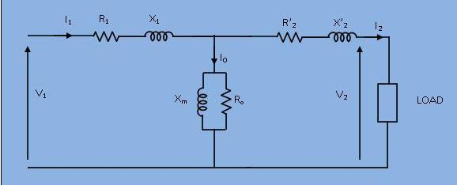

### Theory

The physical basis of the transformer is mutual induction between two circuits  linked by a common magnetic field . Transformer is required to pass electrical energy from one circuit to another, via the medium of the pulsating magnetic field, as efficiently and economically as possible. This could be achieved using either iron or steel which serves as a good permeable path for the mutual magnetic flux.
 

<b>Elementary Transformer:&nbsp;&nbsp; </b>

 [Figure 1]

&nbsp;

&nbsp;&nbsp;&nbsp;Let an alternating voltage V1 be applied to primary coil of N1 turns linking a suitable iron core. A current flows in the coil , establishing a flux
 <b> &phi; </b> in the core.  This flux induces an emf e1 in the coil to counter balance the applied voltage V1. This emf is

 <b> $$e_1=N_1 \frac{d \Phi_p}{dt}$$</b>

&nbsp;

&nbsp;&nbsp;&nbsp;Assuming sinusoidal time variation of the flux , let &nbsp;&nbsp;&nbsp; &nbsp; 
&nbsp;&nbsp; Then, 
  

 <b> $$\Phi_p=\Phi_msin({\omega}t)$$ </b> 
 

 <b> $$e_1=N_1\omega\Phi_mcos(\omega t)$$ </b> 

 <b> $$\omega=2 \pi f$$ </b> 

 The r.m.s value of this voltage is given by :

 <b> $$E_1=4.44fN_1\Phi_m$$ </b>
 

&nbsp; Now if there is a secondary coil of N2 turns, wound on the same core, then by mutual induction an emf e2 is developed therein. The r.m.s value of this voltage is given by :

 
 <b> $$E_2=4.44fN_2\Phi'_m$$ </b>

 
Where &Phi;m' is the maximum value of the (sinusoidal) flux linking the secondary coil  &Phi;s' 

If it is assumed that $$\Phi_p=\Phi_s$$ then the primary and secondary emf bear the following ratio:

 
 <b> $$\frac{e_1}{e_2} = \frac{E_1}{E_2} = {N_1}{N_2}$$ </b>

 

Note that in actual practice, $$\Phi_p=\Phi_s$$ since some of the flux paths linking the primary coil do not link the secondary coil and similarly some of the flux paths linking the secondary coil do not link the primary coil. The fluxes which do not link both the coils are called "Leakage Fluxes" of the primary and secondary coil.&nbsp;

Although the iron core is highly permeable, it is not possible to generate a magnetic field in it without the application of a small m.m.f (magneto motive force, denoted by mmf . 
   

 <b>$$P_h=K_hB_(max)^xf$$ </b>
 

 <b>$$P_e=K_eB_(max)^2f^2$$ </b>
 

 <b> $$P_c=P_h+P_e$$ </b> 

 
 where Ph,Pe,Pc are hysteresis, eddy current and core losses respectively, Kh and Ke are constants which depend upon on the magnetic material, and Bmax is the maximum flux density in the core.

 
<b>Equivalent Circuit of a Practical Transformer:&nbsp;&nbsp; </b>

 

 [Figure 2(a)]

  
<b>Development of Transformer Equivalent Circuit:&nbsp;&nbsp; </b>

 

 [Figure 2(b)]

 
The practical transforme has coils of finite resistance. Though this resistance is actually distributed uniformly, it can be conceived as concentrated. Also, all the flux produced by the primary current cannot confined into a desired path completely as an eletric current.On account of the leakage flux, both the windings have a voltage drop which is due to 'leakage reactance' . The transformer shown in the figure 1 can be resolved into an equivalent circuit as shown in figure 2(a) in which the resistance and leakage reactance of primary and secondary respectively are represented by lumped R1, X1, R2 and X2.This equivalent circuit can be simplified by referring all quantitiesin the secondary side of the transformer to primary side and is shown in figure 2(b).

 
&nbsp;&nbsp;&nbsp;&nbsp;&nbsp;&nbsp;&nbsp;&nbsp;&nbsp;&nbsp; $$R_2'=R_2 (\frac{N_1}{N_2})^2$$ &nbsp;&nbsp;&nbsp;&nbsp;&nbsp;&nbsp;&nbsp;&nbsp;&nbsp;&nbsp; $$X_2'= X_2 (\frac{N_1}{N_2})^2$$ &nbsp;&nbsp;&nbsp;&nbsp;&nbsp;&nbsp;&nbsp;&nbsp;&nbsp;&nbsp; $$I_2'= I_2 \frac{N_2}{N_1}$$ &nbsp;&nbsp;&nbsp;&nbsp;&nbsp;&nbsp;&nbsp;&nbsp;&nbsp;&nbsp; 
$$V_2'= V_2 \frac{N_1}{N_2}$$ 

 
 
<b>Approximate Equivalent Circuit of Transformer:&nbsp;&nbsp; </b>

 

&nbsp;

 
 
 
 

